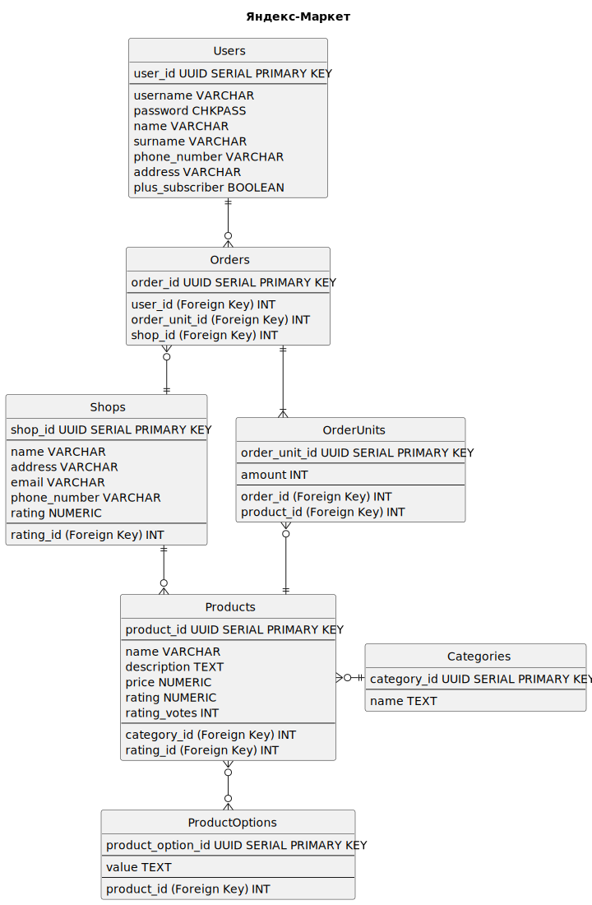

<h2 style="text-align: center;">МИНИСТЕРСТВО ОБРАЗОВАНИЯ И НАУКИ<br/>РОССИЙСКОЙ ФЕДЕРАЦИИ<br/>
ФЕДЕРАЛЬНОЕ ГОСУДАРСТВЕННОЕ АВТОНОМНОЕ ОБРАЗОВАТЕЛЬНОЕ
УЧРЕЖДЕНИЕ ВЫСШЕГО ОБРАЗОВАНИЯ
</h2>

<p style="text-align: center;">«Национальный исследовательский университет ИТМО»</p>

<p style="text-align: center; margin-bottom: 200px">Факультет информационных технологий и программирования</p>

<p style="text-align: center; margin-bottom: 150px">“Проектирование баз данных”<br/>Вариант №5</p>

<h4 style="text-align: center;">Лабораторная работа №1</h3>

<p style="margin-left: 400px">Выполнил: Гаджиев Саид Ильясович M3215</p>

<p style="margin-left: 400px; margin-bottom: 250px">Преподаватель: Кошелев Даниил Викторович</p>

<p style="text-align: center; margin-bottom: 50px">Санкт-Петербург<br/>2024</p>

Вариант №5. Поиск товаров на Яндекс-Маркете.

### Обоснование нахождения модели данных в 3НФ

1НФ: Каждый кортеж отношения содержит только одно значение для каждого из атрибутов.

2НФ: Все атрибуты зависят от потенциального ключа (в модели данных отсутствуют атрибуты, которые не зависят от первичного ключа).

3НФ: Отсутствуют транзитивные функциональные зависимости от потенциального ключа.



<h4>UML</h4>

```
@startuml
title Яндекс-Маркет

hide circle
skinparam linetype ortho

entity User {
    user_id UUID SERIAL PRIMARY KEY
    --
    username VARCHAR
    password CHKPASS
    name VARCHAR
    surname VARCHAR
    phone_number VARCHAR
    address VARCHAR
    plus_subscriber BOOLEAN
}

entity Order {
    order_id UUID SERIAL PRIMARY KEY
    --
    user_id (Foreign Key) INT
    order_state_id (Foreign Key) INT
    shop_id (Foreign Key) INT
}


entity OrderState {
    order_state_id UUID SERIAL PRIMARY KEY
    --
    status TEXT
}
note left of OrderState::status
  ОПЛАЧЕН | СОБИРАЕТСЯ | ОТПРАВЛЕН | ДОСТАВЛЕН | ОТМЕНЁН
end note

entity Shop {
    shop_id UUID SERIAL PRIMARY KEY
    --
    name VARCHAR
    address VARCHAR
    email VARCHAR
    phone_number VARCHAR
    --
    rating_id (Foreign Key) INT
}

entity ShopProduct {
    shop_product_id UUID SERIAL PRIMARY KEY
    --
    amount INT
    --
    shop_id (Foreign Key) INT
    product_id (Foreign Key) INT
}

entity OrderUnit {
    order_unit_id UUID SERIAL PRIMARY KEY
    --
    amount INT
    --
    order_id (Foreign Key) INT
    shop_product_id (Foreign Key) INT
}

entity Product {
    product_id UUID SERIAL PRIMARY KEY
    --
    name VARCHAR
    description TEXT
    price NUMERIC
    --
    product_category_id (Foreign Key) INT
    rating_id (Foreign Key) INT
}

entity Category {
    category_id UUID SERIAL PRIMARY KEY
    --
    name TEXT
}

entity CategoryOption {
    category_option_id UUID SERIAL PRIMARY KEY
    --
    name TEXT
    --
    category_id (Foreign Key) INT
}

entity ProductOption {
    product_option_id UUID SERIAL PRIMARY KEY
    --
    value TEXT
    --
    product_id (Foreign Key) INT
    category_option_id (Foreign Key) INT
}

entity Rating {
    rating_id UUID SERIAL PRIMARY KEY
    --
    rating_average NUMERIC
    rating_votes INT
}

Product }o-right-|| Category
Product }o-left-|| Rating
Category ||--o{ CategoryOption
CategoryOption ||--o{ ProductOption
ProductOption }o--o{ Product
Shop ||--o{ ShopProduct
ShopProduct }o-down-|| Product
Order }o--|| Shop
Order }o-up-|| User
OrderUnit }|-up-|| Order
OrderUnit }o--|| ShopProduct
Order }o-left-|| OrderState

@enduml
```
